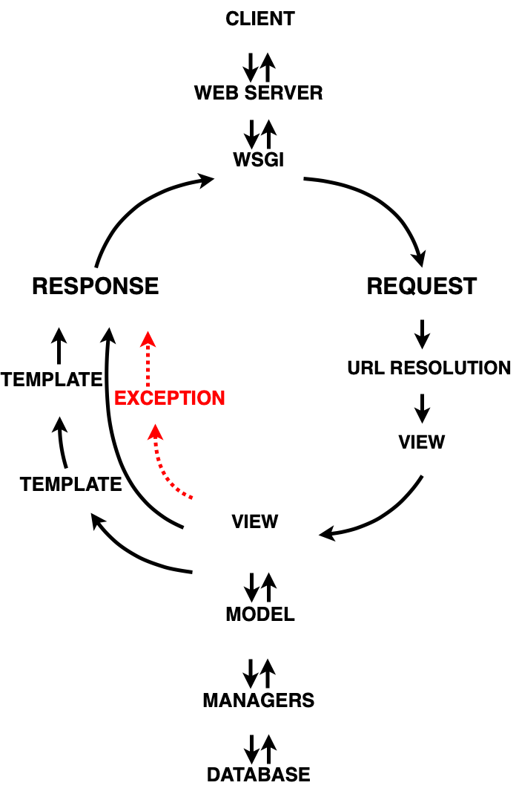
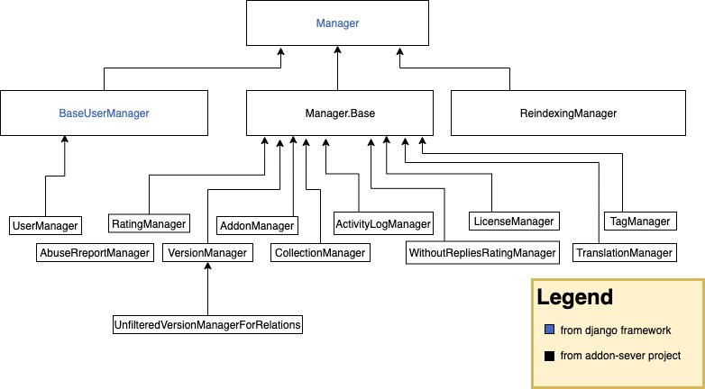
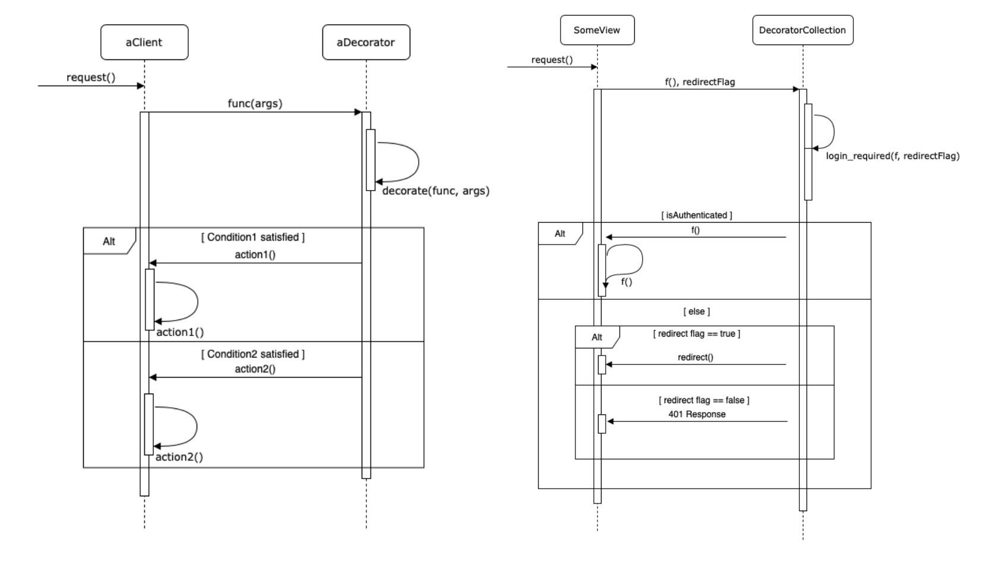

# CSCDO1 PROJECT DELIVERABLE 1

### by Team Anti-CoronaVirus


### Introduction

<hr />

We chose to work on a Django based python application called "[Firefox Browser ADD-ONS Server](https://github.com/mozilla/addons-server)," it is a collection of files that support the ability for an browser extendtion to modify the browser's interface and behaviors. For instance, users could change the color, appearance of the tabs by applying an ADD-ON to the firefox browser. Moreover, one could make the ADD-ON cross-platform such that the same feature could be applied to a different web browser like Google Chrome.

Django is a framework built on python. We examined the source code of this product from the aspect of its architecture and design patterns. Analyzing this project was challenging for our team since not only we 'haven't had a chance to use the Django framework, but also, this is a large scale open-sourced project whose codebase size is more than 1 GB. The diversity of the code styles makes it hard to understand and follow its logic. More details about the code style and the code structure will be discussed later in this report.


### Overall architecture

<hr />

<center>
  
</center>


#### **Brief Introduction to Django Framework**

Based on our observations, we found that this product is using a web framework called Django. Understanding the Diango framework is necessary in order to understand the structure of this project. Django has a similar request-and-respond circle (aka life circle) as other web frameworks do like React and Vue, a life cycle demonstrates how the browser, web server and database communicate with each other. Here we have to introduce some new terminologies that are used in Django: “View,” “Template,” “Model,” and “Manager.”

Django represents the view by a Python function (or method, if the class is involved). Each view is responsible for responding to a request. Either it will return an HttpRespond object or raising an error. View servers on the server-side(backend), yet other types of files are contributing to the display of a webpage: Template. We think of the view as the gears behind a watch and the template as the dial, one is responsible for the functionality and the other is responsible for the exhibition.
Models give you the ability to communicate with the database without using any SQL, which significantly decreases the amount of work required for programmers. Django uses a model to execute SQL behind the scenes to return Python data structures. However, there is one more layer that lies between models and the underlying database: manager, which is responsible for the actual handling of the query.

In conclusion, a view retrieves data from the underlying database through models, then format it into HTTP response object and send the object to the browser, the view makes decisions on what data gets delivered to the template. 

#### Coupling and Cohesion

When we examine the whole code base, we saw that “addons-server/src/Olympia” clearly shows the characteristic of a Django project, the outer layer(Olympia) contains all main life cycle stages(URLs resolution, views, templates, models and manager), while all the subfolders under “Olympia” are also Django apps that all has an individual responsible. This unique characteristic of Django framework implies that the the project has a weak coupling and high cohesion in its design. 

<p float="left">
  
</p>


Above is a UML diagram that shows the relationship between *BaseUserManager*, *Manager.Base*, *ReindexingManager* and *Manager*, as we could see from the diagram, *BaseUserManager*, *Manager.Base*, *ReindexingManager* do not interpass data, thus they have limited information about each other. Also, making changes in one object would not affect the others, the interdependence between these classes is indeed very weak. 

The same structure could be found else where easily under the Django project (“Olympia”). Moreover, as this report has mentioned above, each Django app is only responsible for one function. Thus the cohesion is high. Hence, we concluded that ADD-ONS server has overall weak coupling and high cohesion in its design, which is suitable for software developers like us when it comes to debugging or new features implementing as we have fewer worries about breaking the whole program.


### Hightlights

<hr />

#### Observer Pattern

Some implementations are very similar to Observer Pattern in this project. Since the project is using the Django framework, the original mechanisms of “Observer” have been transmitted to either a manual connection or an automatic `@receiver()` decorator. The connected or decorated functions would observe the signal from the “Observable” and take corresponding actions if a proper signal has been shot.

The signal could be created by or imported from a built-in dependency service of Django called the signal dispatcher. The signals dispatcher in Diango is used for decoupled applications being notified when actions occur elsewhere in the framework. Every generated signal is an instance of django.dispatch.Signal, which belongs to class Signal. 

##### Code Example

The code piece below fetched from addons-server code base shows how to create a signal instance:

*(from addons-server/src/olympia/versions/models.py)*

```python
version_uploaded = django.dispatch.Signal()
```

It declares a version_uploaded signal instance. After creating the signal, we could either connect to the callback function manually or apply the `@receiver()`decorator to bundle the callback function automatically. Below is an example of how to connect to the function manually: 

*(from addons-server/src/olympia/versions/models.py)*

```python
def watch_new_unlisted_version(sender=None, instance=None, **kwargs):
   if instance and instance.channel == amo.RELEASE_CHANNEL_UNLISTED:
       from olympia.amo.tasks import sync_object_to_basket
       sync_object_to_basket.delay('addon', instance.addon.pk)

version_uploaded = django.dispatch.Signal()
version_uploaded.connect(watch_new_unlisted_version)
```

1. Connect to the callback function manually

   If a callback function is connected, the built-in signals would send before or after a model’s corresponding method (e.g. `django.db.models.signals.pre_save, django.db.models.signals.post_save` would send before or after a model’s `save()` method is called). Each `connect()` call could take three arguments, respectively, `receiver`, `sender`, and `dispatch_uid`. “Receiver” is the signal that this function aimed at. “Sender” is the sender who will be the model class being saved. And, “dispatch_uid” is a unique identifier to identify the receiver function. Here is an example:*(from addons-server/src/olympia/versions/models.py)*

```python
models.signals.pre_save.connect(
   save_signal, sender=Version, dispatch_uid='version_translations')
models.signals.post_save.connect(
   update_status, sender=Version, dispatch_uid='version_update_status')
models.signals.post_save.connect(
   inherit_nomination, sender=Version,
   dispatch_uid='version_inherit_nomination')

models.signals.pre_delete.connect(
   cleanup_version, sender=Version, dispatch_uid='cleanup_version')
models.signals.post_delete.connect(
   update_status, sender=Version, dispatch_uid='version_update_status')
```

2. Automatically bundle the callback function T

   he other way is to use @receiver() to identify a callback function as an observer. The arguments of the @receiver() tag are similar to the ones in the manual way above. Once the callback function observed the specified signal from the targeted sender, with the unique dispatch_uid, it will execute itself.The example for @receiver() tag:(from addons-server/src/olympia/addons/models.py). 

```python
@receiver(dbsignals.post_save, sender=Addon, dispatch_uid='addons.search.index')
def update_search_index(sender, instance, **kw):
   from . import tasks
   if not kw.get('raw'):
       tasks.index_addons.delay([instance.id])
```

Also, a lot of observable triggers exist elsewhere. Here are some instances.*(from addons-server/src/olympia/amo/tests/\_init\_.py*)

```python
# Disconnect signals until the last save.
post_save.disconnect(addon_update_search_index, sender=Addon,
                    dispatch_uid='addons.search.index')
```

*(from addons-server/src/olympia/amo/tests/__init__.py)*

```python
# Put signals back.
post_save.connect(addon_update_search_index, sender=Addon,
                 dispatch_uid='addons.search.index')
```

*(from addons-server/src/olympia/landfill/generators.py)*

```python
# Disconnect this signal given that we issue a reindex at the end.
post_save.disconnect(update_search_index, sender=Addon,
                    dispatch_uid='addons.search.index')
```

In conclusion, with the benefits of signal service in Django, it is easier to handle situations where many pieces of code are interested in the same event.


#### Decorator Pattern

Decorator Pattern is also used in the implementation. Something interesting is that the decorator pattern is used in object-oriented programming in our previous courses/experience, but in the project, the decorator pattern is also applied to functional-oriented programming. In object-oriented programming, the motivation behind the Decorator Pattern is to add or alter the behavior of an individual object at runtime dynamically, and without affecting other same class objects. 

Adopting the same idea to functional-oriented programming, this is ideal when you want to dynamically extend the functionality of a function without needing to modify the function, and python allows you to do this. The condition checks in this project were done in a flow, as shown in the below sequence diagram.

<center>
    
</center>


<center>
  <em>The left one is the general diagram, the right one is login_required sequence diagram</em>
</center>

In the project, there is a file called `decorator.py`, which contains all decorators used in amo module. These decorators are intended to be used for condition checking or data mapping. 

##### Code Example

*(from src/olympia/amo/decorators.py)*

Let’s take a closer look at the `login_required()` decorator. 

```python
def login_required(f=None, redirect=True):
   """
   Like Django's login_required, but with to= instead of next=.

   If redirect=False then we return 401 instead of redirecting to the
   login page.  That's nice for ajax views.
   """
   def decorator(func):
       @functools.wraps(func)
       def wrapper(request, *args, **kw):
           # Prevent circular ref in accounts.utils
           from olympia.accounts.utils import redirect_for_login
           if request.user.is_authenticated:
               return func(request, *args, **kw)
           else:
               if redirect:
                   return redirect_for_login(request)
               else:
                   return http.HttpResponse(status=401)
       return wrapper
   if f:
       return decorator(f)
   else:
       return decorator
```

Although `login_required` is defined as a function, it is actually a concrete decorator for authentication status checking. It takes two parameters, the first one is a function, and the second one is a `redirect` flag. The f parameter is an action that requires login to perform, so it got passed into the decorator `login_required`. Within `login_required`, the actual decorator implementation is wrapped into the `decorator(func)` function to make the code look cleaner, which is because the functional-oriented decorator pattern in Python depends on the annotation  `@functools.wraps`. In the wrapper, it checks if the user/account is authenticated, if this user/account is authenticated, it returns the function call to `decorator(func)`, otherwise, based on the value of `redirect` flag, it either returns a `redirect` (to login) function call or 401 response. Outside the `decorator(func)` wrapping, the implementation is clean and straightforward, which is based on if there is a function call passed in, call `decorator()` with different parameters.


### Software Development Process

<hr />

#### Analysis of different development process - Pros and Cons

We will use the Kanban methodology for our next deliverable. Kanban is a workflow management method designed to help us visualize our work, maximize efficiency, and be agile. 

As we have learned from class, with Kanban boards, we can:

- Visualize our work progress
- Instantly spot impediments and take steps to remove them
- Improve communication between team members
- Empower the team to self-manage visual processes and workflows

- Inspire team collaboration

We have also considered other software development processes such as waterfall in plan-driven, scrum, and extreme programming in agile development. However, none of those are suitable for our chosen project. As for waterfall and any other plan-driven development process, it requires a precise specification about what issues we should fix, which we are not clear yet. We have to identify and analyze the feasibility of the open issues, as we get more familiar with the project and then decide which ones we are going to fix. Besides, we might make changes in between. As a result, the inflexibility of the waterfall model is not suitable for our team. 

For extreme programming method, even though it is a good framework that aims to produce higher quality software and higher efficiency for the development team, its strict engineering practices, and the strict working priority order makes this process not feasible for us to adopt since we have a tight schedule to finish the project. 

Moreover, we are not adopting the scrum method because we do not want to stick to a strict timeline as we are not building our software. Instead, we are trying to contribute to an open-source project. Another reason is that this process does not encourage us to make changes to the sprint plan, however, it is hard to follow a strict plan since we are not the only team who are working on the same project. The last reason is that since we already did the scrum process in the CSCC01 project, we would like to try other methods. 

#### Why Kanban?

Hence, the Kanban method stands out. It follows a set of principles and practices for managing and improving the flow of work. More specifically, for our team and our chosen project, it is an evolutionary, non-disruptive method that promotes gradual improvements to our project. Since we did not design and implement our project from scratch, we have to learn this project as we go and look into the potential issues and locate them in the source code and then try to come up with a solution for the issues. As a result, following Kanban’s principle:

- We start with what we are doing now, such as getting familiar with the overall architecture, sorting out the relationship between each component, and providing a higher-level diagram to show the structure of the system
- Agree to pursue incremental, evolutionary change such as we are going to make small incremental change rather than making radical changes because we need to gain more confidence as we play around each segment of codes piece by piece
- Initially, respect current roles, responsibilities, and job titles. Because we all know each other well before this project, and we respect each other and know each other’s strengths, we will collaboratively identify and implement any changes needed
- Encourage acts of leadership at all levels. Since we all know each other’s strengths, and there is no obvious senior talented member in our team, anyone in the team can provide ideas and show leadership to implement changes to improve the way we deliver our project continually

#### What Tools we choose?

Above all else, the Kanban board on Github allows us to make custom columns for how our team works, other than traditional common workflow stages such as To Do, In Progress, In Review and Done. My team will modify the columns into Backlog, Selected for Development, In Progress, Technical Review and Done. In terms of release methodology, updates are released whenever they are ready, without a regular schedule or predetermined due dates like sprint review. 

Since the whole team will have access to the Kanban board, unlike scrum, there is no single “scrum master” who keeps everything running smoothly. It’s the collective responsibility of the entire team to collaborate on and deliver the tasks on the board. Besides, the WIP limit will cap the number of cards that can be in any one column at one time. When one of the members reaches the WIP limit, a tool like Github (which we are going to use) caps that column and the team will swarm on those items to move them forward. Lastly, because of the nature of our chosen project, we will need to add or remove our cards to and from the board frequently, all makes it possible in Kanban workflow.
